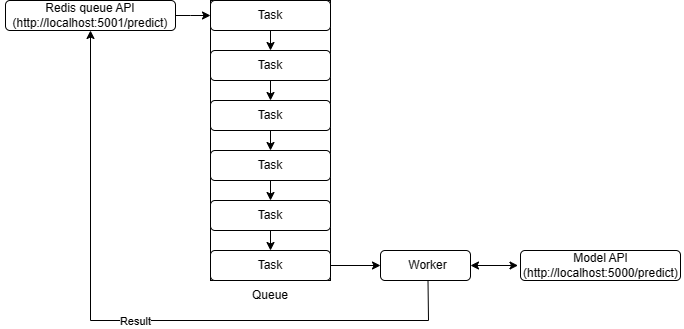
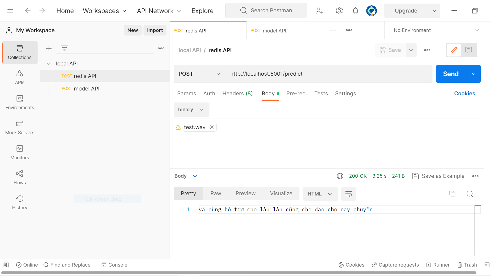

# Speech recognition vietnamese
## Description
This is a Python repo for speech recognition Vietnamese using `wav2vec2-base-vietnamese-250h` model and `whisper-base` model. This repo also contain code to start a Flask API of the model and code for starting a redis queue to listen to the model Flask API

## Requirements
- Python 3.9

## Installation
Run the following command to install library

`pip install -r requirements.txt`

to download the whisper-base model file run the following command

`wget -P ./Whisper_base_model https://huggingface.co/VtAIP/whisper-base/resolve/main/pytorch_model.bin`

and to download the wav2vec2-base-vietnamese-250h model file run the following command

`wget -P ./Wav2Vec2_VI_model https://huggingface.co/nguyenvulebinh/wav2vec2-base-vietnamese-250h/resolve/main/pytorch_model.bin`

if you using window os use the following command to download the whisper-base model

`Invoke-WebRequest -Uri https://huggingface.co/VtAIP/whisper-base/resolve/main/pytorch_model.bin -OutFile ./Whisper_base_model/pytorch_model.bin`

and to download the wav2vec2-base-vietnamese-250h model file run the following command

`Invoke-WebRequest -Uri https://huggingface.co/nguyenvulebinh/wav2vec2-base-vietnamese-250h/resolve/main/pytorch_model.bin -OutFile ./Wav2Vec2_VI_model/pytorch_model.bin`

For running the redis queue you will also need to install redis server, on Linux the following command will install redis server

`sudo apt-get install redis`

On Windows however, it is necessary to have WSL installed, you can install redis with the same command above in a WSL terminal.
## Usage
You have a few options for running these models. To perform inference using the `wav2vec2-base-vietnamese-250h` model, execute the `infer_wav2vec.py` file. For the `whisper-base model`, use the `infer_whisper.py` file.

Alternatively, you can start a Flask API for the `whisper-base` model by running `whisper_API.py`. This will launch an API at `http://localhost:5000/predict`.

Once the model Flask API is up and running, you can also initiate a Redis queue to call the model API by first starting the redis server with the command

`redis-server`

This will start the redis server at the default port 6379 in localhost.
Next you can start the redis worker with the command

`rq worker`

And finally start the API by running the `redis_enqueue.py` file in WSL, this will start the Redis API at `http://localhost:5001/predict`.

Here is the diagram that represent the code workflow

 

The input for both API are as follow

 

## Credits
This repo uses the wav2vec2-base-vietnamese-250h model developed by nguyenvulebinh from VietAI and the Whisper-base model developed by OpenAI, coupled with the Hugging Face Transformers library, which is an open-source library for NLP models.